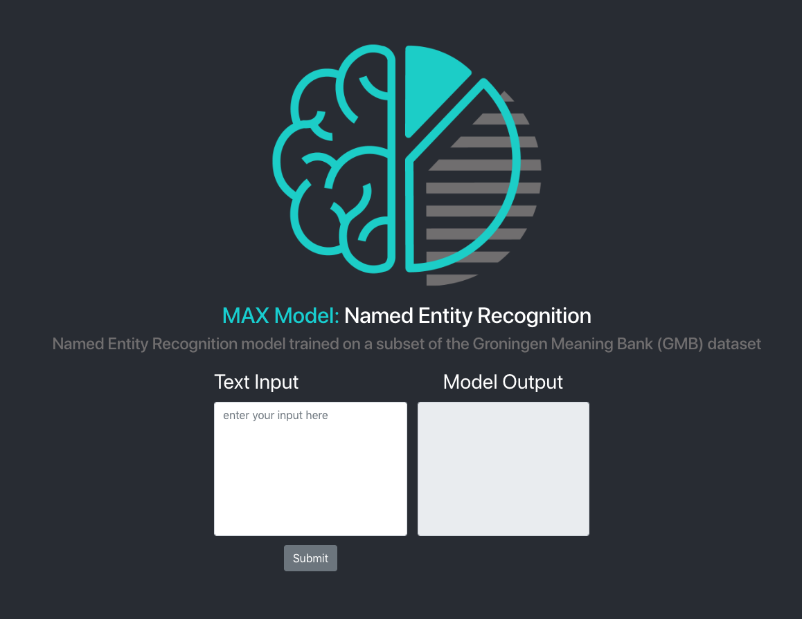
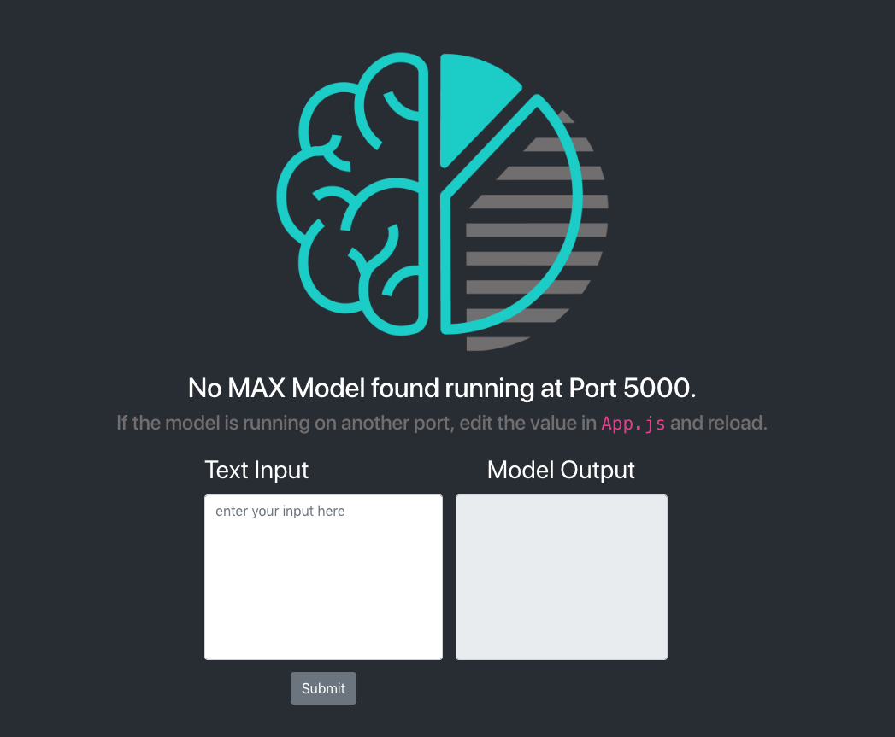
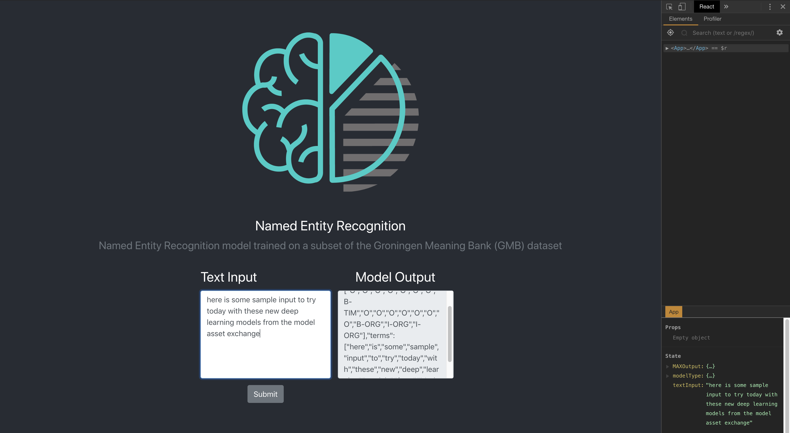

# MAX Model Boilerplate Web App 
## `React` edition

This is a React App with a basic UI for interacting with Models from the [Model Asset eXchange](https://developer.ibm.com/code/exchanges/models/).

This app assumes you are also running a deep learning from the **Model Asset eXchange** on port `5000` (the default port used by MAX Models). These models can run in either local or container environments, but make sure to specify `-e CORS_ENABLE=true` to set the proper environment variables to allow cross-origin requests if your model is running in a Docker container.

### Starting the App

You will know right away if the boilerplate app can communicate with your MAX Model. If it can, you will see the name and description of the current model (which is taken from the `metadata` endpoint), like this:

If the app can't communicate with your MAX Model, you will see this message:

### Sending Input to the Model

Input may be provided in _either text or image form_, **depending on the needs of the MAX Model you are using.**

By default, _both_ are displayed in the app, but feel free to remove/edit either the `TextIO` or `ImageIO` components as needed.

### Receiving Output from the Model

Output from the MAX Model comes in JSON format, which is stored in the application's state and can be displayed directly on the page with the `RawOutput` component. (using [React Dev Tools](https://github.com/facebook/react-devtools) is **strongly recommended** when debugging React apps)

#### More `React`-related info...

This project was bootstrapped with [Create React App](https://github.com/facebook/create-react-app).

## Available Scripts

In the project directory, you can run:

### `npm start`

Runs the app in the development mode. 
Open [http://localhost:3000](http://localhost:3000) to view it in the browser.

The page will reload if you make edits. 
You will also see any lint errors in the console.

### `npm test`

Launches the test runner in the interactive watch mode. 
See the section about [running tests](https://facebook.github.io/create-react-app/docs/running-tests) for more information.

### `npm run build`

Builds the app for production to the `build` folder. 
It correctly bundles React in production mode and optimizes the build for the best performance.

The build is minified and the filenames include the hashes. 
Your app is ready to be deployed!

See the section about [deployment](https://facebook.github.io/create-react-app/docs/deployment) for more information.

### `npm run eject`

**Note: this is a one-way operation. Once you `eject`, you can’t go back!**

If you aren’t satisfied with the build tool and configuration choices, you can `eject` at any time. This command will remove the single build dependency from your project.

Instead, it will copy all the configuration files and the transitive dependencies (Webpack, Babel, ESLint, etc) right into your project so you have full control over them. All of the commands except `eject` will still work, but they will point to the copied scripts so you can tweak them. At this point you’re on your own.

You don’t have to ever use `eject`. The curated feature set is suitable for small and middle deployments, and you shouldn’t feel obligated to use this feature. However we understand that this tool wouldn’t be useful if you couldn’t customize it when you are ready for it.

## Learn More

You can learn more in the [Create React App documentation](https://facebook.github.io/create-react-app/docs/getting-started).

To learn React, check out the [React documentation](https://reactjs.org/).
